# Инструкция по загрузке файлов в GitHub (РИП, 5 семестр)

## Установка Git
1. Скачайте Git по ссылке: 
   [Git for Windows](https://github.com/git-for-windows/git/releases/download/v2.48.1.windows.1/Git-2.48.1-64-bit.exe)
2. Проверьте успешную установку, выполнив команду:
   ```sh
   git --version
   ```
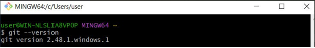

## Создание репозитория и подготовка
1. Создайте папку с таким же названием, как у вашего репозитория (например, `it-maintenance-backend`).
2. Репозиторий должен быть **публичным**.
3. Откройте папку в VS Code (**Открыть с помощью → VS Code**).
4. Инициализируйте репозиторий:
   ```sh
   git init
   ```
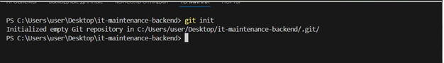

   Внутри появится скрытая папка `.git`.

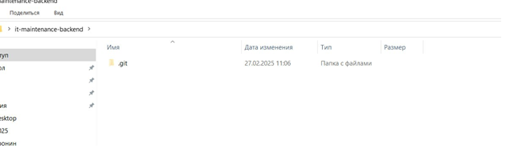

5. Создайте файл `README.md` и добавьте описание:
   ```md
   # Репозиторий backend по курсу "Разработка интернет-приложений"
   ```
6. Зафиксируйте изменения:
   ```sh
   git add .
   git commit -m "first commit"
   ```
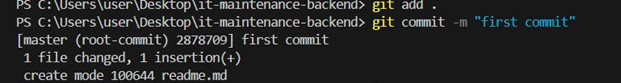

## Загрузка кода в GitHub
1. Введите последовательно команды:
   ```sh
   git remote add origin <URL_репозитория>
   git branch -M main
   git push -u origin main
   ```
2. В открывшемся окне авторизации введите учетные данные GitHub.


3. После успешного выполнения команды файлы появятся в репозитории.

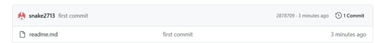

## Работа с ветками
Для каждой лабораторной работы создайте отдельную ветку. 
Примеры:
- **1 лабораторная** → `ssr_imMemory`
- **2 лабораторная** → `ssr_inDb`
- **3 лабораторная** → `SPA_backend`
- **4 лабораторная** → `SPA_backend_swagger`

### Создание новой ветки и загрузка файлов
```sh
# Создание и переход в ветку
git checkout -b "ssr_imMemory"

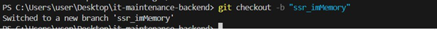

#Необходимо перенести файлы лабораторной работы в нашу папку 

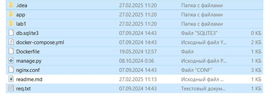

# Добавление файлов
git add .
git commit -m "lab1 first commit"


# Отправка изменений. Изначально достаточно написать просто git push и терминал вам предложит ввести полную команду. В нашем случае она будет:
git push --set-upstream origin ssr_imMemory
```

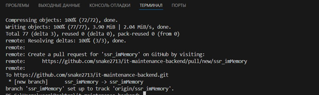

### Проверка изменений
1. Скопируйте команду, которую выдаст терминал после `git push`.
2. Перейдите в репозиторий на GitHub и убедитесь, что файлы загружены.

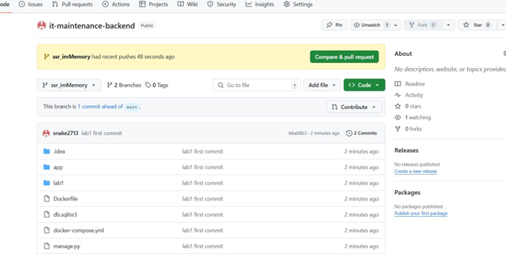

### Возвращение в основную ветку
```sh
git checkout main
```

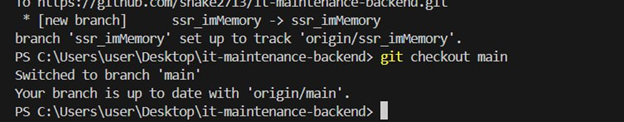

Файлы из папки исчезнут, так как вы переключились на другую ветку.

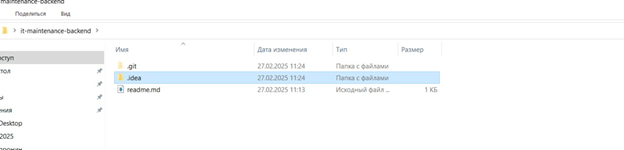

## Повторение для следующих лабораторных работ
Для каждой следующей работы повторите цикл:
1. Создайте новую ветку: `git checkout -b "<название_ветки>"`
2. Перенесите файлы лабораторной работы в папку проекта.
3. Зафиксируйте и отправьте изменения: 
   ```sh
   git add .
   git commit -m "labX first commit"
   git push --set-upstream origin <название_ветки>
   ```
